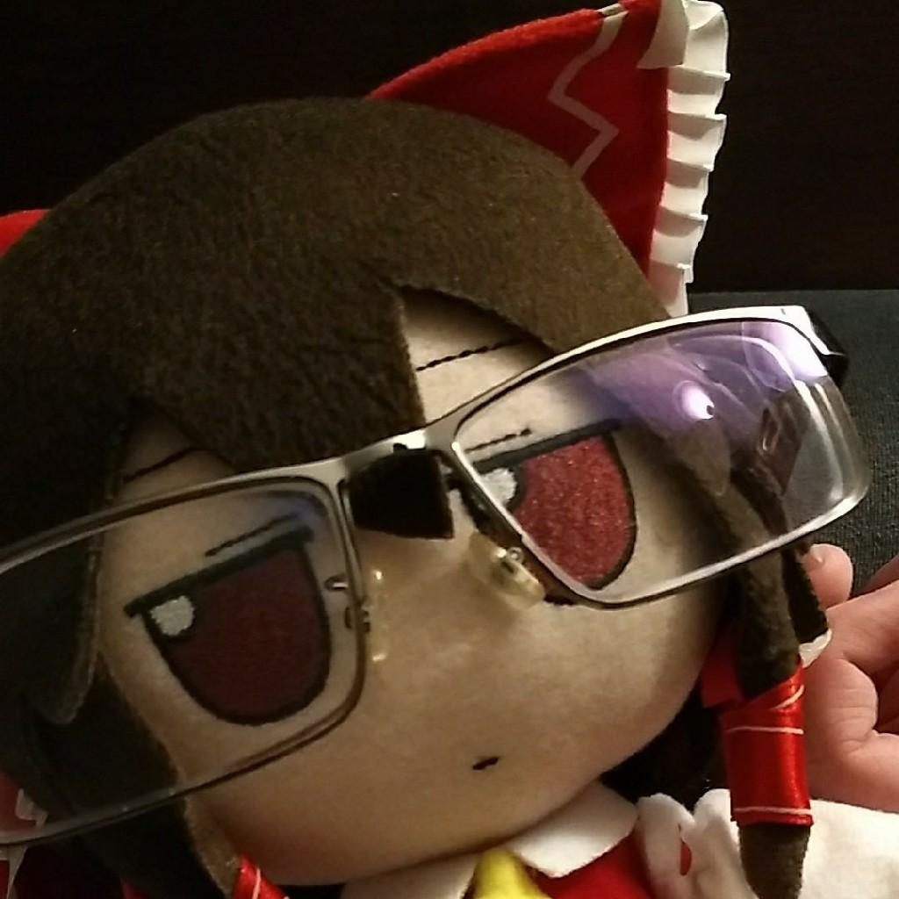
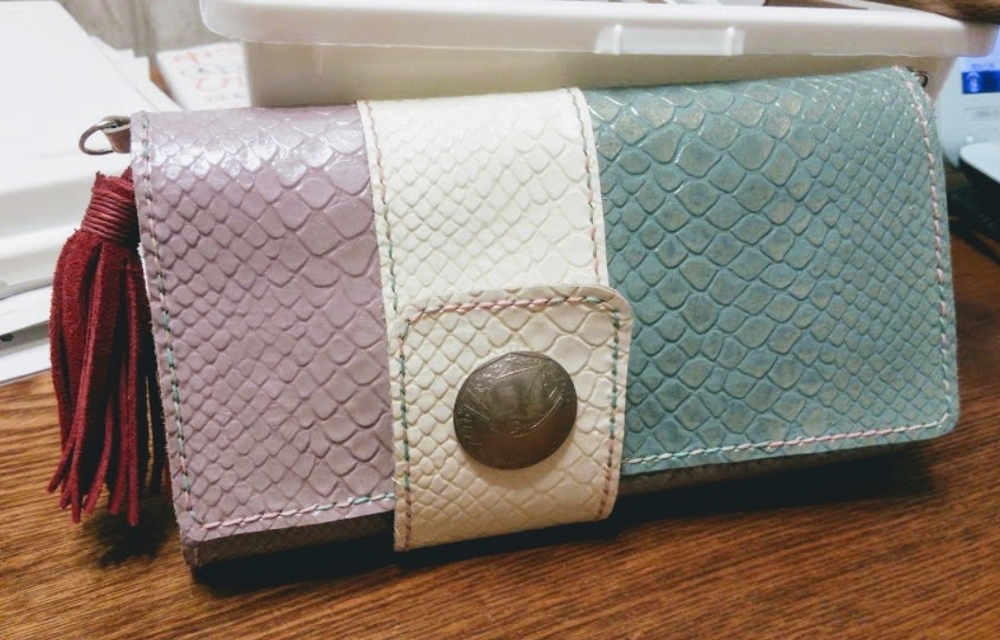
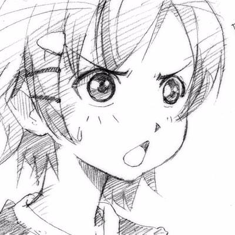
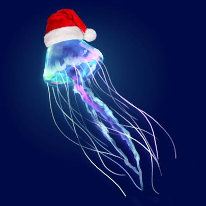
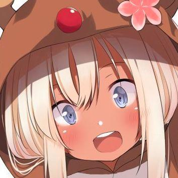
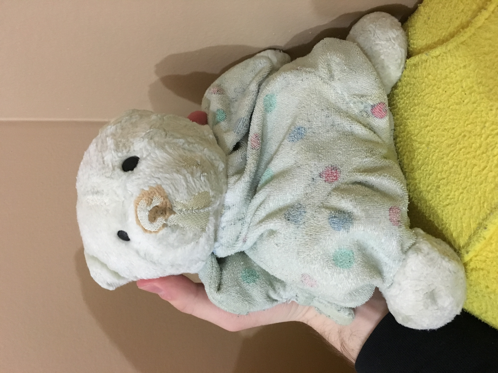
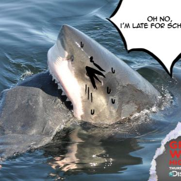
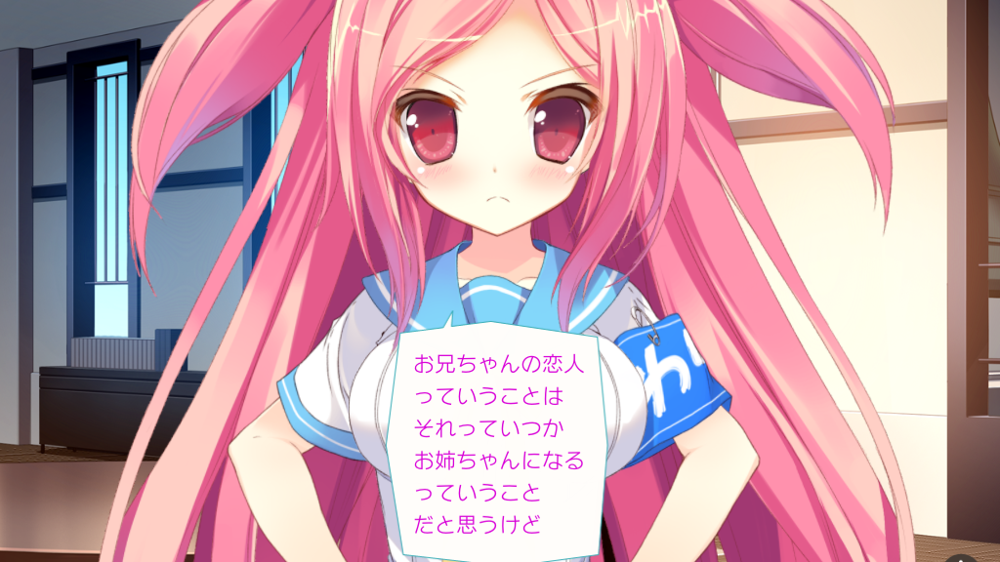

# English-Japanese Exchange - 2018 Advent Calendar

## Calendar・カレンダー

| Sunday (日) | Monday (月) | Tuesday (火) | Wednesday (水) | Thursday (木) | Friday (金) | Saturday (土) |
|---------------|----------|-----------|-----------|------------|----------|------------  |
|               |          |           |           |            | 1        | **2**        |
| **3**         | 4        | 5         | 6         | 7          | 8        | **9**        |
| **10**        | [11](#11)| [12](#12) | [13](#13) | [14](#14)  | [15](#15)| [**16**](#16)|
| [**17**](#17) | [18](#18)| [19](#19) | [20](#20) | [21](#21)  | [22](#22)| [**23**](#23)|
| [**24**](#24) | [25](#25)| [26](#26) | [27](#27) | [28](#28)  | [29](#29)| [**30**](#30)|
| [**31**](#31) |          |           |           |            |          |              |

### Week One・第１週目

  [**Dec 11** - Shini](#11)
  
  [**Dec 12** - TofuMars](#12)
  
  [**Dec 13** - Sorana](#13)
  
  [**Dec 14** - 1to2](#14)
  
  [**Dec 15** - Dukky_](#15)
  
  [**Dec 16** - Zeri](#16)
  
  [**Dec 17** - Stella](#17)
  
### Week Two・第２週目

  [**Dec 18** - 魁星(kaisei)-INFP](#18)
  
  [**Dec 19** - Skyz](#19)
  
  [**Dec 20** - Kei (Kevin)](#20)
  
  [**Dec 21** - ESPAlchemist](#21)
  
  [**Dec 22** - checkerpeck](#22)
  
  [**Dec 23** - Pentacal](#23)
    
  [**Dec 24** - ](#24)
  
### Week Three・第３週目

  [**Dec 25** - ](#25)
  
  [**Dec 26** - newyams99 | にーも](#26)
  
  [**Dec 27** - ](#27)
  
  [**Dec 28** - ](#28)
  
  [**Dec 29** - ](#29)
  
  [**Dec 30** - ](#30)
    
  [**Dec 31** - ](#31)

 

## Week One・第１週目 

### December 11 - Shini 

#### アドベント・カレンダー２０１８

##### トピック：シニの好きな物の話

誰にも好きな物って一つに限らない筈だ。好きな食べ物とか、好きな動物とか、好きな映画とか、他にも色々ある筈だ。その上、好きな物っていうのは、いつも同じやつじゃない筈だ。子供の頃好きだった物は今も好きって言えないかもしれない。だから、僕にも好きな物は時によって、または気分によって、沢山あるんだ。それが理由で何か一つの好きな物について話すのは難しい。だからとにかく二つにしようかな。

１．「ブランドン・サンダースン」の「コズミアー」。
ブランドン・サンダースンはアメリカ人のファンタジー作家だ。その作家の作品は多く二種類に別れてるんだ。まずはコズミアーじゃないやつ：レコナーズ（三冊）、ザ・リズマティスト（一冊）、アルカトラズ（現在五冊）、スカイワード（現在一冊）、リージャン（二冊）。コズミアーじゃないやつは地球に起こるやつなんだ。（ブランドン・サンダースン本当に化物だと思う。毎年必ず一つ以上の小説が発売されるんだ）。例えば、（今読んでいる小説）スカイワードは遠く未来に宇宙の地球コロニーからクレルという宇宙人にデトリアスという星へ逃げ出された人間の話なんだ。つまり、その人間の歴史とか文化とかは我々のものと同じという事だ。
コズミアーの本はコズミアーという作り物の特別な銀河に起こる物だ。ストームライト・アーカイブはローシャーという星で、ミストボーンはスカドリアルという星の物語だ。僕はブランドン・サンダースンの作品を読み始めたのはストームライト・アーカイブからだった。

２．ゴードン・ラムゼイの番組
ゴードン・ラムゼイの事は多分聞いたことあるだろう？え、ないの？初耳なの？じゃあ、説明してあげるよ。彼は料理世界の（歌手とダンサーの）マイケル・ジャクソンみたいな人だ。（格闘家の）ブルース・リーみたいな人。十九歳で料理習うためフランスに引っ越して色々レストランで小さな仕事から初めていろんなトップ・シェフから料理を習った人だ。自分の努力と才能で料理の世界の階段を登ってきた男だから、他の料理人に対して結構厳しい構えだ。ラムゼイの番組でいろんなところから色んな種類のコックが出てくるけど、相手は誰でも構わず、ミスしたら、激しく怒って、上手くできたら褒めてくれる人だ。所謂「タフ　バット　フェア」ってことだ。

##### トピック：シニの新年の抱負

年が変わるといつも聞かれるでしょう、「新年の抱負は何？」って？僕は基本的に新年抱負が嫌いだ。いくら決心して決めたところで、結局何も変わらない。一ヶ月以内気が緩んでしまう。その上、抱負の決意が固いほど、プレッシャーが溜まっちゃう。それが理由で抱負決めるのは嫌だ。でも、２０１９はちょっと違う。今の所は気まぐれ．．．と言っても良いと思うけど、新年抱負を決めた。僕にとっては、読書と著作することが大事なんだ。でも、大学のせいとか、ワニカニのせいとか、就職のせいとか、他にも色々理由があって、本を読んだり、文章書いたりする時間が中々見つからないところだ。でも固く決意して頑張るしかない。失敗するかもしれない。気がすぐ緩むかもしれない。でもとにかく、新年抱負は．．年が終わるまで必ず二十小説（英語で）やそれ以上の小説読むつもりだ。そして、毎日一時間以上日本語の読書、二時間は自分のストーリー書くことするつもりだ。全部できるかどうか、可能かどうか、まだ分からないけど、一歩ずつ足を動かせないと前へ進めない。頑張る。失敗したら、また一から初める。

##### トピック：２０１８に起きた忘れられない話（シニ版）

多分八月だったかな。はっきり思い出せないけど、恐らくその頃だった。クラスメートと先生、皆で僕が住んでいる都市の原子力発電所に行った。一生忘れないー、いや、忘れられない経験だった。朝から夕べまでその原発の内外見せられた。核燃料電池のパーツ、そのパーツの作り方、その製造場の仕組み見れたんだ。そこの科学者と先生達は我ら生徒の質問に答えて、その上、私達に与えたかった知識を自分から説明してあげた。僕は大学に入学した時から初めて何か役に立つ物を得てると思った。原発機器の特別な機能とかを習って、初めて本当の工学者の感じがした。絶対忘れてはいけない経験だった。
___

### December 12 - TofuMars 

#### アドベント•カレンダー 2018:

##### トフの好きな物話

私の好きな物はめいぐるみです。今は100つのめいぐるみを戻っている。子どもいたら、毎週におばあさんは一つのめいぐるみを作ってくれる。おばあさんのめいぐるみは鳥みたい。週末に、私はめいぐるみとテレビを見た。

そのめいぐるみは友達だった。人間の友達を少し戻った。私のめいぐるみがいつも私のそばにあるので、私のめいぐるみは家族ある。

今時、私はめいぐるみを買っている。ふもふものめいぐるみが好き。でもそのめいぐるみが高い。しかし、ふもはフワフワなめいぐるみです。時々、私はふもと会社に行く。みんなは私のふもが大好き。かわいいだから :3.

___

### December 13 - Sorana 

#### Advent Calendar: the 13th of December 2018 
##### My favorite thing

One of my favorite things is handcrafts. 
I think I like it since when I was a child. 
The oldest thing I made as far as I remember was a embroidered pen case made from felts when I was in 4th grade of elementary school. 
I made it as a birthday present for my mother.  
And I also made baby clothes when my children were small. 
Anyway, I still love to do handcraft, and recently, the most favorite handcraft is a leathercraft. 
Especially, I love to make it with patchworking from a lot of pieces of leather rather than making by a big sheet of leather. 
I usually decide a theme when I make them. 
The theme is come up when I see a piece of leather. 
For example, when I saw a scaly blue leather, I imaged "a little mermaid". 
and then, I looked inside a big basket, which there are a lot of pieces of leather in it, and picked out some leathers that fits the image. 
Furthermore, I searched an internet and found a button of ship at online shop.
And the wallet, which I posted below this essay,  is what I imaged and completed.
the most fun time is when I am imagining from a piece of leather. 
I am looking forward to finding out a new leather which gives me a good inspiration as ever.

___

### December 14 - 1to2 

#### アドベントカレンダー ２０１８年１２月１４日

十三歳の時(2012年)に中国に連れて行かれたことで学校にいけなくなり、友達との連絡も失った。外国人・外国育ちだとバレたらスリに狙われたりボッタクリ被害に遭ってもおかしくないから中国語がぎこちなかった私は声を出すのが怖くなってきた。長期間誰ともしゃべらず、家で引きこもっていた。

新年の抱負は３つある

日本で職業訓練を受けるまたは志望大学に受かること。

恐怖症を克服してアメリカを離れてから初の友達を作ること。

不幸を嘆くより自分の置かれた状況を受け入れて配られたカードで勝負していきたい。

シニさんの著作「Shini in Paris　スーパーエクストラデラックスエディション日本語版」を待ち侘びています。
そしてこのサーバの皆さんと来年のこの頃に再び会えるならこの上なく嬉しいことだと思います。

___

### December 15 - Dukky_ 

#### アドベント・カレンダー２０１８ 12月1５日
日本語の上手じゃないですから、多分間違をする、すみません。

あああああはい、私の好きな活動は音楽プロデュースする。子供の時、毎日新しいし珍しい音楽を聞きました。『どうやってそれをできますか？』と思いました。その時、音楽プロデュースは不可能そうでした。

今、たくさん練習の後、（ときどき）いい音楽をプロデュースします。変な物音が好きです

（今日は忙しかったですから、この’BLOG'はちょっと遅いごめなさい。疲れますｗｗｗｗｗｗｗ）
ahahahaha 完璧ね
___

### December 16 - Zeri 

#### アドベント・カレンダー２０１８  12月16日
##### トピック：過去に起きた忘れられない話・聞くは一時の恥、聞かぬは一生の恥

　今年、動物園学のプログラムのガイドを務めたことがある。日程はあったけど、予期せぬ状況によって、その日程を調整する必要がたまにあった。例えば、プログラムの二日目の朝は天気予報の通り、非常に晴れていたのに、ローンパインという保護区に到着して30分もたたないうちに大雨が降り始めたので、保護区の代わりに買い物に行くことが決まった。

　しかし、その30分の間に、生徒達はもう保護区の全体に散らばっていた。我ら五人の職員は散開して、生徒達を駆り集めるために保護区の中を捜索した。集合場所について聞くべきだったが、事情に詳しく分かるふりをした私は、何も確認しなかった。結局、他のみんなが北口で待っている間、私が集めた生徒は南口まで付いてきた。　

　不明な点に対して、色々対処法がある。経験者に聞く人がいれば、自分で調べて解決する人もいる。自立でやらないといけないと思っていた私のせいで、その日の計画が丸つぶれになってしまった。私の考え方はただの傲慢だと気付いた。

　私のような失敗を回避する為、他の人に相談するのは恥ではないと忘れないでください。諺にもある通り、「聞くは一時の恥、聞かぬは一生の恥」だ。
___

### December 17 - Stella 

#### Advent Calendar: the 17th of December 2018
##### My new year's resolution

Hello members! I'm Stella.
At first, look at this link.

> Hi! Im Stella. Im from JP. I really want learn more Englsih and I dream of the day, I speach English perfectly. My English is pretty bad. So I go to eng_chat, just_hanging_out  etc, and enjoy learn to English. If you senpais see me, please talk to me, then correct my bad English.Thank you...
ステラと申します。英語の勉強がしたくてたまらないので、みなさん私の話す英語が間違えてたら教えて下さい。
短いですが、これで終わりにします。よろしくおねがいします 

This message is my self introduction in May.
I wonder how much I'm getting better at speaking English.
And yes, I chose this theme because I want to study English more and more in 2019! 
So my new year's resolution is "speaking English like a Japanese flight attendant"
I don't mean I want to be a flight attendant, but don't you think they are really cool and they can speak English fluently?

My old days dream was I wanted to be a Japanese secretary.
They are so smart and cool... And I guess they can speak English perfectly.
But unfortunately, I really didn't like studying English when I was a student.
Because I couldn't understand what my teacher was saying!!
Present progressive...??? Past perfect...??? Be verbs...!!!???
Then, I stopped thinking about English.
I was like,
"Haha~ we are Japanese, who does care about English? We don't need that"
But... Yes, I was wrong.

I'm currently working at my office. And there are lots of coworkers here(only seniors in my office though).
Some seniors can reply E-mail for overseas people!!
And I ask how is your English skill to one senior. Then she said,
"Um~. I don't know, but I only have Eiken grade 3"
I was shocked very much...
I have that grade, but I can't do that like her...
Also that grade is for junior high school students!!!!(I got that when I was 15 years old)
So she learned English herself!
My sense of rivalry was heating up.
I want to be cooler than 2018 in 2019!!!!

I only use this server for studying English. If you guys think,
"Oh, Stella's English is improved! Better than that introduction!"
Then, because of you guys!
Keep being nice for English learners!
I'll do my best for Japanese learners!!
Thank you for talking with me everyone, every times!
And thank you for reading! Bye bye~

___

### December 18 - 魁星(kaisei)-INFP 

#### Advent cal 18/12/2018 (Tue)

Hey there, it’s my turn and I am writing about things I like. (I chose the easiest topic for me :D)

First of all, I am so curious that I have wide interests in many genres, for example, Literatures, arts, movies, musics, biology, philosophy and so on. Then I picked up my favourite animals to write. 

I love penguins with no kidding. I love the most awkward and the coolest birds. Do you know how many sub-species penguin has? It’s 18,in addition, they are all living in south hemisphere.  I want you to know any any penguin has habitats in north polar. Moreover, the penguins which live in harsh cold places are just half of all penguin’s sub-species. Most of them rather have their habitats in warmer locations, take Africa penguin for instant, they live near Cape town in South Africa, in which average temperature is 16.8℃. Did you know that? 
In fact, we could not research some of penguins enough to understand their lives like where they hunt fish, so actually they are mysterious 😃
As a last, I introduce my favourite penguin to you; it’s Chin- strap penguin. Their habitats are placed in Sub-Antarctic Islands. The reason why I love them most is their face. Look for it if you got an interest because that is the best way to have you know about them. 

I hope some will be a fun of these cutest birds 😃 thank you.

___

### December 19 - Skyz 

#### スカイズのアドベントカレンダー！

おそらくはすごく詰まらないので、本当に読みたければ我慢してください！

新年の抱負は来年を今年よりもっといいことをする。というと、来年もっと勉強をすると僕自身を成長させる。来年を今年よりうまくすることは多分全然難しくないかもしれない。その結果を達するためにできる限り頑張る！それに日本語にももっとうまくなるためにこのサーバーでは話し続けるつもりだ。今後もよろしくおねがいします~

僕の好きなものは２つがある。ぬいぐるみと食べ物だ。誰かがもうぬいぐるみについて書いてあったので、短くする。ぬいぐるみとは、絶対に裏切らないふわふわもふもふという存在である。それはぬいぐるみだ。ぬいぐふるみ大好きだ。生まれ日からテディというクマぬいぐるみがもっていて、ずっと一緒にいて大好きな相棒だ。ぬいぐるみが相棒であるとは変かどうかしらないけど、全然構わない。下の写真でテディに挨拶をしてください。

それで食べ物。沢山食べ物が好きで、辛い物や、甘い物や、肉や、魚だ。野菜は嫌だ。いつも食べすぎている。体に悪いことがちゃんとわかっているけど一生で食べるのは一番幸せのことだ。でも結局、一番美味しいものとはやはりいい友達と一緒に食べる物だ！

全部を読んでくれてありがとうございました！

___

### December 20 - Kei (Kevin) 

#### アドベント・カレンダー２０１８ 12月20日
##### 笑顔の育ち方（私にとって興味深い話）

人生は甘くないから、幸せの時も苦しい時もあるはずだが、  
幸せの時が思い出せば、笑顔がゼロから育てられると思います。  
私は子供の頃に、お金が学校料金とか生活料金のために使われました、  
残りほっとんどなかったです。つまり、私の家族は貧乏だったと思います。  

アメリカの映画では、クリスマスの時はプレセントを上げる季節と教えたんだけど、  
お金がない私は良いプレセントを上げられなかった気に成りました。  
私のいとこ達はさらにお金持ちなので、毎年高いプレセントが私に上げさせたが  
私も私ののご両親もお金がなかったので、そんなに高いプレセントを上げ返せませんでした。  
ある日、私の叔母さん（ママの姉妹）達から「貴方が上げたプレセントがあまり良くないから来年もっと良いプレセント上げられないの？」  
とママに言われました。叔母さん達は多分子供からの不満が言い返しただけだったが、その日から恨んでいました。  
プレセントを「あげる」じゃなくて、「取引」になったと思ったからママが不安になったクリスマスの頃に姉妹と会う気が消えてしまいました。

パパの家族会うのもママに寂しくしたので、その日からクリスマスは核家族のみ会って外に出られませんでした。  
あの頃、ママが不安になったから私は叔母ちゃんが攻めてしまって、笑顔が亡くしたと思います。  
プレセントがちゃんと上げなかったから皆は心配になっただろう。  
叔母さん達は「子供はそんなに重いこと考えなくていい」と私に言われたが、私は悩んでいました。  
だって私は同じことをやりたくないから悩んでいて悩んでいて  
どうやってプレセントをちゃんと上げるのが悩んでいましたが  

私の考えは間違っていました。  
私の叔母さんがやっていることは上げることじゃなくて、プレセントエクスチェンジでした。  
プレセントを上げることには別に術はないだろう。  
ただし、プレンと受けるのが美味い人がいると思います。  

次の年、叔母さん（パパの兄弟）は私の家族の問題を聞いて私達三兄弟が心配になって、様子を見にプレセントを上げるために家に来ました。  
昨年を思い出して私は不安になって良いプレセント上げたかったがまたお金がなかったので、また悩んでいました。  

「私の家族は貧乏だから良いプレセント上げられない  
貧乏だから取引なんて出来ない  
もう昨年みたいに喧嘩したくないから  
プレセント上げるのが悩んでいるから  
プレセント上げるのが困っているから  
どうするか分からないよ」  

と私の気持ちが手で書いた詩に書いていて  
せめて理解する方法が貰いたかったでした。  
叔母さんは私の手で書いた詩を読んで、私が笑顔で抱きしめました。  
叔母さんも子供のごろ貧乏だったから同情できましただろう。  
分かってくれたと思いました。   
叔母さんは私の手で書いた誌を持って読んで、  
私の考えが間違えたこと気づいた  
私が亡くした笑顔が戻っていました。

その時私がクリスマスに欲しいものは高くないものではありませんでした。  
ただ、私の気持ちをちゃんと受けてもらいたかったことです。  
安いものですが、  
気に入れてものじゃなくてもちゃんと受けてください。

人生は甘くないから、幸せの時も苦しい時もあるはずだが、  
幸せの時が思い出せば、笑顔がゼロから育てられると思います。  
プレセントがちゃんと上げる方法はないと思うが  
皆さん、プレセントちゃんと受けてください。

___

### December 21 - Checkerpeck 

#### アドカレ：１２月２１日２０１８年

##### おチェッカーちゃんの好きなもの。

私の好きなものはうちお兄ちゃんです！え？人をものを扱ってますかってあなた方は多分そう思ってますけど、「お兄ちゃんは私のもの！」とかを聞いたことがありますね。それに、「物」と「者」の読み方は「もの」です。同じじゃないですか！話題の「もの」がひり仮名で書いたから両方の解釈は可能です！うにゃはっはっ（笑い声）です！

うちのお兄ちゃんは私のことをいつでも気遣ってくれる人です。言われなくてもお兄ちゃんはケーキや駄菓子を私の元に運ぶとか、私がいいことをしたら（テストの点数がいいとか、フランスパンをよく作って焼いたとか）お兄ちゃんは頭をなでなでしてくれます！私が悪いことを犯したらお兄ちゃんは頭撫で撫でで私を慰めてくれます。お兄ちゃんは気が向いたら、頭なでなでしてくれる、お兄ちゃんと手を私の頭を乗せたら、空気を読めるお兄ちゃんは頭なでなでしてくれます。

お兄ちゃんの性格はいいです。彼女一人、二人を作ったことがありましたけど、私がちょっと餅を焼いて、その彼女に「あたいのお兄ちゃんに手を出すな！お兄ちゃんはね、お兄ちゃんはね、お兄ちゃんはあたいが結婚しますからね！この泥棒猫がぁ！」とかを母語のフランス語で言ったことがいっぱいありました。でもでも、そんなことをしてもは意外といいです！お兄ちゃんはダメウーメンズ*が好みで、良い女の子の私のことが好きなら他の女の人を付き合わなくてもいいですね！

*ダメンズ（男） -> ダメウーメンズ（女）

___

### December 22 - ESPAlchemist 

#### アドベントカレンダー２０１８ 12月22日

私の好きなものといえば、話題によってちがうからたくさんありますが、いつもテンキ予報にもうすぐ雨降りの日があると見掛けるたびになんか微妙な興奮を感じます。実は、そのような日、数えきれないほどの困難で不便なことがあるみたいですね。道路を見たりしにくくなって運転が面倒臭くいし、服も靴もあまがさあっても濡れることが多いし、確かに誰に対しても好ましくない天気でしょうか。

それなのに、わたしはいつでも晴れてて熱い地帯からのヒトだから雨の日は非常に珍しいこと。ときどき、ひとつの雲もない日が数日間連続で続いすべてが永遠の青いで彩っているみたい。概してイえば、快いっていう言葉でそれを表現できるかもしれないがどこでも太陽さんの日差しや熱気から逃げられないところもある。だから灰色の雲たちが来てそのハテのない空を覆う時には、まるで全く変わった環境に沈んだようなキモチ。たまにはすこし肌寒いそよカゼが体を撫で自分の体温だけに包まれている。

どしゃぶりになったら、そのようしゃなく降り注ぐ雨粒がひとつヒトツ地面に会う音が世界中をこだまする、雲からの旅の終わりを宣言するかのようだ。人が近くに居てもその無名のぼんやりした顔が傘と雨がっぱに隠され響きと白いカスミの壁に隔てられていることで、たぶん、陰ウツなきもちというより儚い孤独におおわれているといえる。

そのような日、周りのかつて混雑で慌ただしいこの街が穏やかでヒトケのない世界になってしまってから、好きな音楽聴きながら、あくせくせずに近所の公園へ散歩するのが好きです。あそこでそのめったに見ない日常に潜んでいる景色、その雨宿りしているリスたち、その街路の表面に映っている明かりがすべてほしいだけ眺められる。

そして、雨上がりに太陽さんがもう一回トウミンから目覚めるみたいに雲の後ろから下の地球をときどきチラッとのぞき自分のやさしい光を世界中に広げる。外の空気に独特な説明しづらいほど爽快感が漂っている。自然の木々をジッとミミを傾けたらコトリ達の歌声がかすかに聞こえる。

そのすべてを理由として、そのような経験を自分のひとつの好きなものだとおもう。

___

### December 23 - Pentacal 

#### アドベント・カレンダー
##### 12月23日

僕の趣味はアーチェリー。5年前偶然に始めた。ひたすら集中してねらって、矢を放して、ストレスがどんなに溜まってもさっさと吹っ飛んでいく。
アーチェリーを練習するほど、集中力がよく鍛えてきた。集中力は仕事にも日常にも役に立つと思う。

新年の抱負が２つある

##### 決めたことがもう中途半端をしないように
RPGを理解するため、日本語の勉強が20年前に始めた。当時はネットもないので、分からない言葉が多すぎてやめた。2回目は2010ぐらい、日本のMMOをしたいので日本語のサーバー入った。ほかのプレイヤーに言いたいことが伝えにくくて、迷惑をかけた。ハードルが高すぎだと思う僕はもう一度あきらめた。今度はもう三日坊主をしたくない。今年は勉強を続けるため、このサーバーに入った。皆と一緒に勉強するのはいいやる気になった。

新年はそのやる気で続けると決めた。

##### もっと家族と一緒に時間を過ごすように

11月、次女が生まれた。家にいるべきのに仕事が忙しくて、毎日残業してしまった。同僚はその僕を見て、「子供時代は一度だけよ、大事にしてね」と言った。その言葉は僕がよく考えた。来年はママが仕事に戻して、娘は保育所に預ける予定。ママの負担を分けてほしい。だから、僕はできるだけ早く仕事を済んで帰宅して、家事を分担したり、長女に物語を読んだり、もっと家族と一緒に時間を過ごすつもりです。

\-------------------------------------

みんなのおかげで、僕の日本語の進歩が感じている。まだ得意とは言えないけど、自信がどんどんあるになって、とてもうれしいです。来年もよろしくお願いします。

___

### December 24 - Kakashi 

##### 24日12月18年

こんばんは、カカシです。 漫画とか日本の音楽が好き。

漫画を読むために日本語の勉強をはじめたんだ。

私がEJLXに参加した時を振り返ってみると、何もわからなかったってことをいつも思い出す。
ひらがなとカタカナと基本的な文法を勉強して、JLPT N5 のサンプルテストを合格して、なんでもできる気がした。
でも N5 を何回合格しても、漫画を上手に読むことができなかったから、実践で日本語を勉強しようと思った。

私は日本語がうまくなるため、EJLXの人たちに話しかけたり、会話の練習をしたりした。
いろんなことを習って、知り合いになった人がいた。
現在はその人たちが友達っていうか。
練習がどんどん楽しくなったんだ。
皆は優しくて、日本語について質問を容易に答えてくれた。

漫画を読む以外にも、皆とおしゃべりするのも好きで、今年も勉強は頑張らないといけない。
皆と日本語で簡単にいろんなことについて話したり、他の初心者にお手伝いできるようになりたい。

それが、私の New Year's Resolution です。

___

### December 25 - Morisi 

#### Advent Calendar, December 25

##### "My favorite thing"

I love watching movies. Movies broaden your knowledge about acting, photographing, lighting, editing, producing, costumes, story-telling and even historical or political background of a particular event.  

I “study” filming just for fun, but I’ve ever made some videos for wedding parties of my friends. I learned lots of things through the process and found movies are not real at all even if it’s categorized as a documentary film. The fact, however, makes it fascinating for me to watch movies because it means that you can see things through their eyes, sharing their passions or philosophies. I believe movies have an endemic language and cannot be translated into natural language; therefore I rarely talk or write about films though I adore them.  

So I feel every movie is worth watching unless I give up finding something from it, say, what and how they tried to express in the work or how people reacted to it. Compared to the last year, I don't think I watched many movies this year. I hope I have much more encounters next year.   

Thank you very much for reading. Merry Christmas for everyone.  

___

### December 26 - Newyams99 | にーも 

#### Advent Calendar 12/26 

サンタさんは、いないと思う。そう、毎年策を練って、煙突も、セキュリティーに隙もない住宅にどうにか忍び込んで、残すプレゼントで必ず子供達を笑顔にするサンタさん。
いや、「必ず」ではない。    
幼い頃の自分は確信を持って、サンタさんはプレゼントを選ぶことだけには揺るぎない自信があるから、「必ず」そうしてくれるのだと主張しながらサンタさんに匹敵するものなどいないと、信じ込んでいた。  
が、歳を重ねるに連れ、憧れのサンタさんへの疑心は募る一方であった。  
世界中の子供達がどうしても欲しいという物を一瞬で完全に把握できる不思議な機械でも発明したのだろうか。光速を超えるという物理法則に背くことのできる、何千年の鍛錬を積んだ結果である超能力といっても過言ではない凄技でもあったのだろうか、サンタさんは。  
どうにも怪しい。幾ら夢を叶えてくれるサンタさんでも不可能なことは不可能だ。  
こう考え、サンタさんなんていないという結論に至った。  
こう悟ったのはいつだっただろう。当時の自分にとっては俄かに信じ難い事実ではあったが、サンタさんは幻想に過ぎない偽人物であることが判明されると同時に真のサンタさんに纏わっていた霞が徐々に晴れていった。それは、トナカイとともに世界を巡るまん丸の顔をした白髪の老爺ではなく、身近にいる、自分にとって最も大切に思う多数の人物であった。  
人生の道を覚束ない足取りで歩んでいく自分を絶え間なく、丁寧に導いてくれる両親。  
お互い支えあって、自分と一緒に様々な困難を乗り越えていく友人。  
どんなに落ち込んでいようと、自分の悩みに耳を傾け、最後には絶対に笑わせてくれる恋人。  
これらの人達はこの様なプレゼントを、年に一度だけではなく、いつも残してくれているのだと、自分ははっきりと言える。  
なぜなら、「プレゼント」という英単語には二つの意味が含まれている。一つの意味は「贈り物」、もう一つの意味は「今」を表している。この二つの意味から、「今」の時間は一番の「贈り物」だと、よく英語圏で伝えられている。これは、過去の失敗に惑わされず、未来の欲望に目を眩まれずに、大事な人と過ごす貴い時間をじっくり堪能し、今を生きることを指しているのだと、自分は考えている。  
だからサンタさんはいないのだと思う。サンタさんが与えてくれる喜びを上回る、幸せという名の最高のプレゼントを残してくれる人達が今、あなたの傍にいる。  